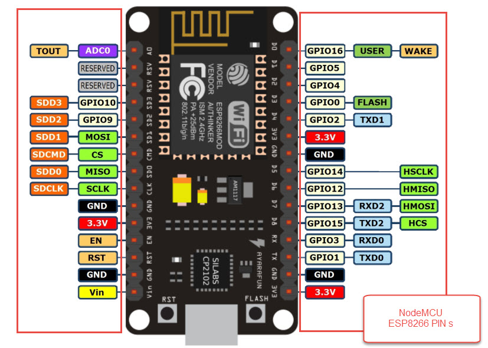

# ROBO

A simple "framework" to make the life easier when using `arduino-cli` and esp8266 boards.
You also can use with arduino boards or others esp boards, just with some little changes at the `Makefile`.

## Dependencies

- [Arduino CLI](https://github.com/arduino/arduino-cli)
- [Picocom](https://github.com/npat-efault/picocom)

## Getting Started

### Setup

Cloning the repository:

```shell
git clone https://github.com/Raisess/robo
cd robo
```

Configuration setup:

```shell
make init
```

- add the esp8266 board core url `https://arduino.esp8266.com/stable/package_esp8266com_index.json`
to the `board_manager.additional_urls` array, at the `~/.arduino15/arduino-cli.yaml` file.

Installing board core:

```shell
make install
```

Building, flashing and serial monitor:

```shell
make
make upload
make serial
```

Edit the `main/main.ino`, do the last step again. :)

## ESP8266

The main target of this project.

### ESP8266 Pinout


